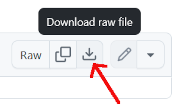
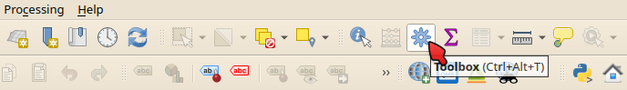
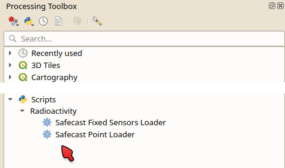
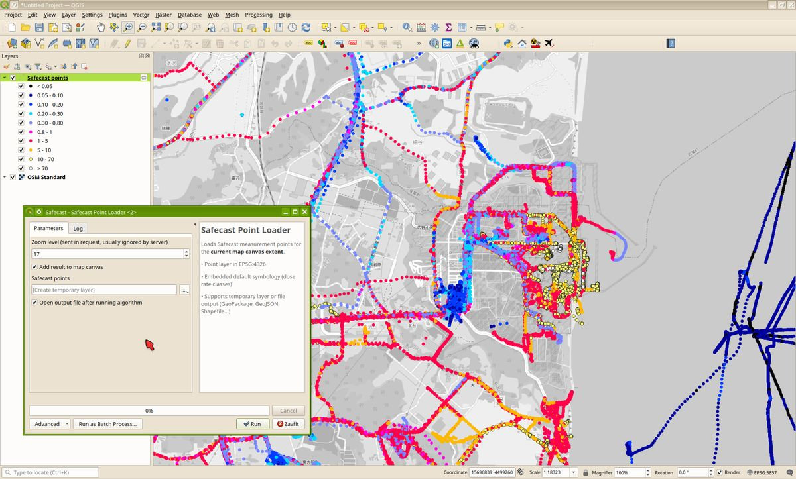
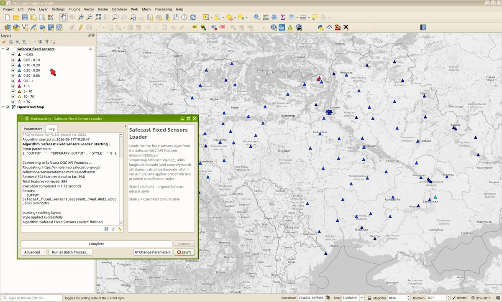
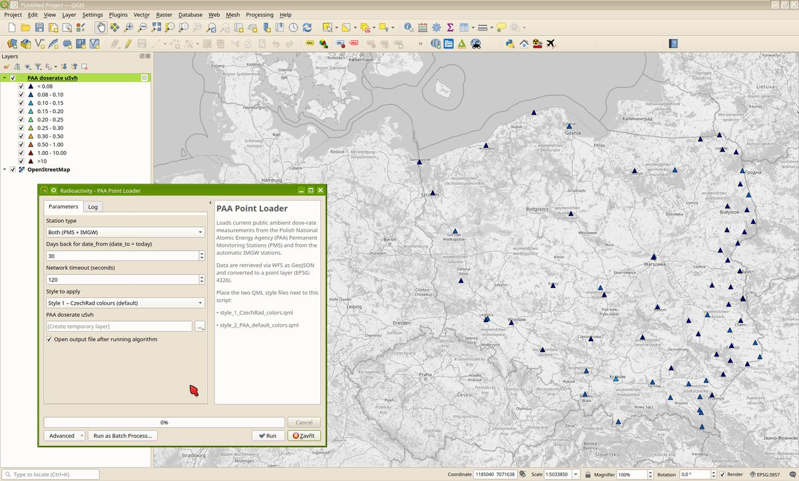
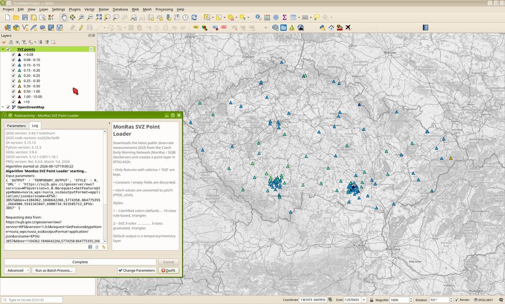

# QGIS-Processing-tools
Here you will find various scripts for the QGIS 3.x Processing Toolbox. The scripts were created in good faith, primarily to make the work of users in the field of citizen radioactivity measurements more comfortable.

Please be kind and do not abuse these tools to over-extract data from the respective data providers, so that we do not lose access to this data.

The functionality of the scripts was tested on QGIS 3.44 Solothurn (LTR release) on Windows and Kubuntu GNU/Linux.

## Installation:

Just download the *.py file from "scripts" here - click the provided link and then the Download raw file icon:

and copy the file to the scripts subfolder in your QGIS user profile - the path is usually like this:

Windows: %APPDATA%\QGIS\QGIS3\profiles\default\processing\scripts

Linux: ~/.local/share/QGIS/QGIS3/profiles/default/processing/scripts

macOS: ~/Library/Application Support/QGIS/QGIS3/profiles/default/processing/scripts

Or just go to the main QGIS menu toolbar and choose *Settings / User Profiles / Open Active Profile Folder* - the profile folder will open in the default file manager.

If you have QGIS running, close it and restart it. When QGIS starts, it automatically searches for newly added scripts and adds them to the Processing Toolbox. On the main QGIS toolbar, click on the gear icon - Toolbox:

You can find the scripts at the very bottom:

Run the script with a mouse double-click, each script has a graphical user interface - it's not a command line thing.

## Safecast Point Loader

Loads Safecast measurement points (bGeigie imports) for the <b>current map canvas extent</b>.
**Download:** [Safecast_Point_Loader_v3_0.py](https://github.com/juhele/QGIS-Processing-tools/blob/main/scripts/Safecast_Point_Loader_v3_0.py)

* Point layer in EPSG:4326
* Embedded default symbology (dose rate classes)
* Supports temporary layer or file output (GeoPackage, GeoJSON, Shapefile…)

The script uses an endpoint from the Safecast New Map (https://simplemap.safecast.org/) - the goal was to be able to view and work with Safecast data (bGeigie, CzechRad devices) without having to download the entire large dataset.

## Safecast Fixed Sensors Loader

Loads Safecast realtime fixed sensons data (Pointcast, Solarcast etc.).
**Download:** [Safecast_Fixed_Sensors_Loader_v2.py](https://github.com/juhele/QGIS-Processing-tools/blob/main/scripts/Safecast_Fixed_Sensors_Loader_v2.py)

* Loads the live fixed sensors layer from the Safecast OGC API Features endpoint
* Adds longitude/latitude (and xcoord/ycoord) attributes
* Calculates doserate_uSvh = value / 334
* Applies one of the two provided classification styles (user can choose "Style 1 (default) = original Safecast default style" or "Style 2 = CzechRad color style")
* Supports temporary layer or file output (GeoPackage, GeoJSON, Shapefile…)

The script uses OGC API Features endpoint from the Safecast New Map (https://simplemap.safecast.org/).

## PAA Point Loader (Poland)

This script loads current public dose rate data from Polish network of Permanent Monitoring Stations (PMS) managed by PAA (Państwowa Agencja Atomistyki / National Atomic Energy Agency) and data from automatic IMGW stations provided by the Institute of Meteorology and Water Management (Instytut Meteorologii i Gospodarki Wodnej Państwowy Instytut Badawczy). The interactive [PAA map](https://monitoring.paa.gov.pl/maps-portal/) even has export to Esri Shapefile, but for a quick comparison with CzechRad data measured by the user this script may be more comfortable.

**Download:** [PAA_Point_Loader_v5.zip](https://github.com/juhele/QGIS-Processing-tools/blob/main/scripts/PAA_Point_Loader_v5.zip) and extract the *.py and the two *.qml files in the "scripts" folder (details in "Installation" section)

* Point layer in EPSG:4326
* Applies one of the two provided classification styles (user can choose "style_1_CzechRad_colors = CzechRad colours style" or "style_2_PAA_default_colors = default style used for PAA online map")
* Supports temporary layer or file output (GeoPackage, GeoJSON, Shapefile…)

We consider the use of the data in the above manner to be "fair use" (please cite PAA and IMGW correctly as the data source), but if you want to use the data for other purposes, please consult with the original data providers - i.e. PAA and IMGW..

## MonRas SVZ Point Loader (Czechia)

This script loads current public dose rate data from the Czech SVZ real-time radiation monitoring network (SVZ = in Czech "Síť včasného zjištění" - English: EWN - Early Warning Network) public dose-rate points from https://sujb.gov.cz (MonRas / nuvia_wps:nuvia_svz) managed by State Office for Nuclear Safety (SÚJB - Czech: Státní úřad pro jadernou bezpečnost). Their interactive [public MonRas map](https://sujb.gov.cz/aplikace/monras/), unfortunately, displays the data in a single-color symbol, so it is impossible to visually see the differences in values ​​without having to manually click through all the points of interest. The map also does not have the option to download the data. 

This script allows both a simple visual evaluation of values ​​on the map and their subsequent comparison with your own measurements, e.g. with the Safecast bGeigie Nano or CzechRad device, without causing excessive load on the SÚJB servers. The script loads the same data as the online MonRas map when clicking on the SVZ icon - but the user no longer loads the rest of the online MonRas application, the background map, and does not have to find out the values ​​of specific stations by clicking on them one by one.

**Download:** [MonRas_SVZ_Point_Loader_v5.py](https://github.com/juhele/QGIS-Processing-tools/blob/main/scripts/MonRas_SVZ_Point_Loader_v5.py)

* Point layer in EPSG:4326
* Applies one of the two provided classification styles (user can choose "1 – CzechRad colors (detailed)" or "2 – SVZ 3-color" style that corresponds to the three-color symbology (green-yellow-red) that SÚJB uses for publicly published maps - for example, maps from Exercise ZÓNA, measurements of mobile groups, etc.)
* Supports temporary layer or file output (GeoPackage, GeoJSON, Shapefile…)

We consider the use of the data in the above manner to be "fair use" (please cite SÚJB correctly as the data source), but if you want to use the data for other purposes, please consult with the original data provider - i.e. SÚJB (https://sujb.gov.cz)..

DISCLAIMER:

THE SOFTWARE IS PROVIDED “AS IS”, WITHOUT WARRANTY OF ANY KIND, EXPRESS OR IMPLIED, INCLUDING BUT NOT LIMITED TO THE WARRANTIES OF MERCHANTABILITY, FITNESS FOR A PARTICULAR PURPOSE AND NONINFRINGEMENT. IN NO EVENT SHALL THE AUTHORS OR COPYRIGHT HOLDERS BE LIABLE FOR ANY CLAIM, DAMAGES OR OTHER LIABILITY, WHETHER IN AN ACTION OF CONTRACT, TORT OR OTHERWISE, ARISING FROM, OUT OF OR IN CONNECTION WITH THE SOFTWARE OR THE USE OR OTHER DEALINGS IN THE SOFTWARE
